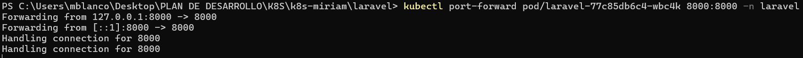
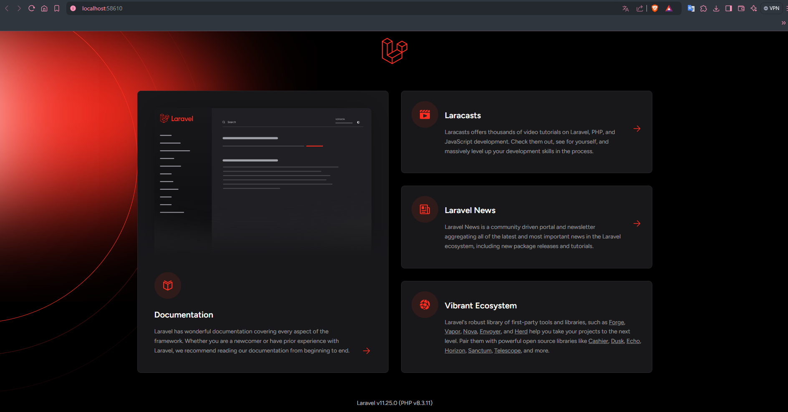

# KUBERNETES

>Para la creación del clúster he hecho uso de un [workflow](https://github.com/stemdo-labs/final-project-common-resources/actions/workflows/tf_apply.yml) del siguiente repositorio: [final-project-common-resources](https://github.com/stemdo-labs/final-project-common-resources).

## Aplicativo Laravel

- Con la creación del clúster, el ``Namespace`` llamado ``laravel`` ya está creado, pero se ejecutaría el siguiente comando para crearlo:

    ```bash
    kubectl create namespace <nombre_namespace>
    ```

- Lo siguiente es la creación del archivo `laravel-deployment.yml` y `laravel-service.yml` y se aplican con los siguientes comandos:

    ```bash
    kubectl apply -f laravel-deployment.yml
    ```
    ```bash
    kubectl apply -f laravel-service.yml
    ```

- Para comprobar el estado del pod:
    - Muestra lista de pods levantados:
        ```bash
        kubectl get pods -n <namespace>
        ```
    - Muestra pods en concreto:
        ```bash
        kubectl describe pod <nombre-del-pod> -n <namespace>
        ```

- Para verificar ip externa:

    ```bash
    kubectl get svc -n <namespace>
    ```

- MySQL es la Base de Datos elegida para el ejercicio, creamos el archivo `mysql-deployment.yml` y el `mysql-service.yml`. Para la contraseña de la BBDD he creado un secreto en kubernetes llamado `mysql-secret` con el siguiente comando:

    ```bash
    kubectl create secret generic <nombre-secreto> --from-literal=MYSQL_ROOT_PASSWORD=<contraseña> -n <namespace>
    ```

- Añadimos al archivo `laravel-deployment.yml` las credenciales de la BBDD, para ello creamos un secreto llamado `laravel-secret` con el usuario y la contraseña con el siguiente comando: 

    ```bash
    kubectl create secret generic <nombre_secreto> --from-literal=DB_USERNAME=<usuario> --from-literal=DB_PASSWORD=<contraseña> -n <namespace>
    ```

- Para comprobar que todo va correctamente necesitamos hacer un port forwarding para redirigir el puerto local a el del pod y poder acceder desde el navegador:

    ```bash
    kubectl port-forward pod/<nombre_pod> <puerto_pod>:<puerto_local> -n <namespace>
    ```





## Aplicativo phpMyAdmin

- Con la creación del clúster, el ``Namespace`` llamado ``phpmyadmin`` ya está creado, pero se ejecutaría el siguiente comando para crearlo:

    ```bash
    kubectl create namespace <nombre_namespace>
    ```


